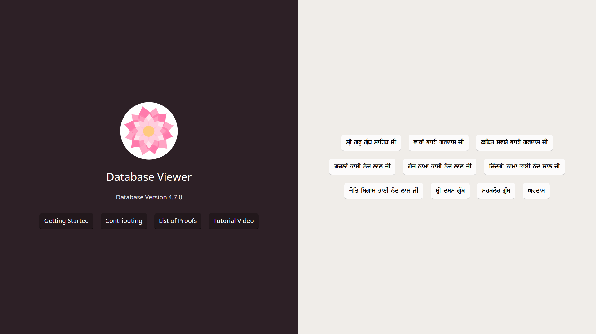
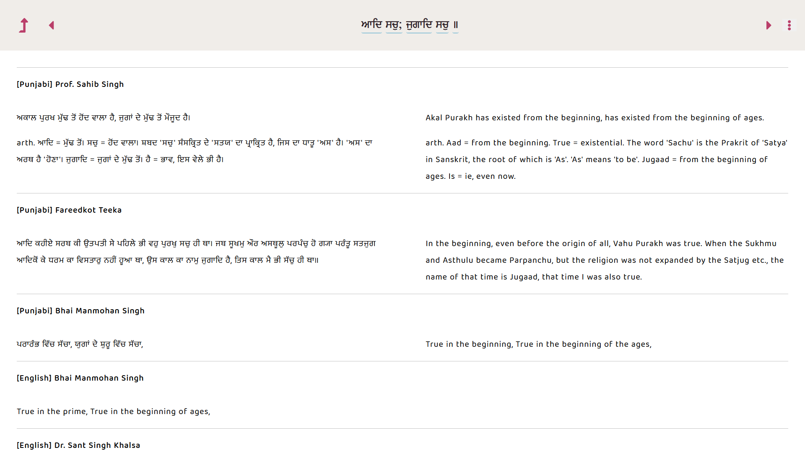

# Shabad OS Viewer

An online viewer of the Shabad OS Database

## Table of Contents

- [Introduction](#introduction)
  - [Features](#features)
  - [Screenshots](#screenshots)
  - [Community](#community)
- [Contributing](#contributing)
- [Related Projects](#related-projects)
- [Code of Conduct](#code-of-conduct)
- [License](#license)

## Introduction

The Shabad OS Viewer quickly shows what is available in the Shabad OS Database. It can be used for research. It can be used for proofreading. It can be used for auditing. [See it online in your browser](https://viewer.shabados.com).

### Features

- Read in long form or click on lines for research purposes
- Submit issue tickets for any line while proofreading (Related: [tutorial guide](https://tutorials.shabados.com/tutorials/1.0.0/database-viewer/proofreading.html); [issue tracker](https://github.com/ShabadOS/database/issues))
- Automatically sync with the latest Database release
- Use left and right keyboard hotkeys for iterating
- Lookup dictionary results of individual lines

### Screenshots

### Community

Get updates on Shabad OS and chat with the project maintainers and community members.

- [![Instagram][instagram-image]][instagram-url] Follow Shabad OS on Instagram
- [![Twitter][twitter-image]][twitter-url] Follow Shabad OS on Twitter.
- [![Chat][chat-image]][chat-url] Join the official Slack channel.
- [![WhatsApp][whatsapp-image]][whatsapp-url] Direct message us on WhatsApp. Or chat with fellow Shabad OS community members in the WhatsApp group chat.

## Contributing

There are multiple ways to contribute whether you are a user or developer. For example:

- [Learn to proofread](https://tutorials.shabados.com/tutorials/1.0.0/database-viewer/proofreading.html) and improve the accuracy of the Shabad OS Database.
- [Submit bugs and feature requests](https://github.com/ShabadOS/viewer/issues/new).
- Review documentation and make pull requests for anything from typos to new content.
- Give feedback on the onboarding process to make it easier for others to join the project.

And "Thank you!" to [all the volunteers][contributor-url] who've already contributed to Shabad OS!

## Feedback

- Ask a question via [Slack][chat-url] or [WhatsApp][whatsapp-url]
- [Upvote popular feature requests](https://github.com/ShabadOS/viewer/issues?q=is%3Aopen+is%3Aissue+label%3A%22Type%3A+Feature%2FEnhancement%22+sort%3Areactions-%2B1-desc) using the thumbs-up/+1 reaction on the first post of a feature request
- Follow [@shabad_os on Instagram](instagram-url) and [@shabad_os on Twitter](twitter-url) and let us know what you think!

## Related Projects

Projects in the Shabad OS ecosystem of free and open source software which interact with or are used by the viewer repo include:

- [Database](https://github.com/ShabadOS/database)
- [Gurmukhi Utils](https://github.com/ShabadOS/gurmukhi-utils)

## Code of Conduct

Please note that this project is released under the Contributor Covenant. By participating in this project you agree to abide by its terms. Our intention is to signal a safe open-source community by welcoming all people to contribute, and pledging in return to value them as whole human beings and to foster an atmosphere of kindness, cooperation, and understanding.

> We as members, contributors, and leaders pledge to make participation in our community a harassment-free experience for everyone, regardless of age, body size, visible or invisible disability, ethnicity, sex characteristics, gender identity and expression, level of experience, education, socio-economic status, nationality, personal appearance, race, religion, or sexual identity and orientation.

> We pledge to act and interact in ways that contribute to an open, welcoming, diverse, inclusive, and healthy community.

> [The Contributor Covenant][code-of-conduct-url]

## License

The viewer repo is under v3 of the [GPL](LICENSE.md). It is similar to the Golden Rule: do unto others as you would have them do unto you. In exchange for benefitting from the work completed in this repo, others must share their derivative work under v3 of the [GPL](LICENSE.md).

> This program is free software: you can redistribute it and/or modify it under the terms of the GNU General Public License as published by the Free Software Foundation, either version 3 of the License, or (at your option) any later version.

> This program is distributed in the hope that it will be useful, but WITHOUT ANY WARRANTY; without even the implied warranty of MERCHANTABILITY or FITNESS FOR A PARTICULAR PURPOSE. See the GNU General Public License for more details.

> You should have received a copy of the GNU General Public License along with this program. If not, see <https://www.gnu.org/licenses/>.

[instagram-image]: https://img.shields.io/badge/Instagram-%40shabad__os-C13584.svg?logo=instagram&logoColor=white
[instagram-url]: https://www.instagram.com/shabad_os/
[twitter-image]: https://img.shields.io/badge/Twitter-%40shabad__os-1DA1F2.svg?logo=twitter&logoColor=white
[twitter-url]: https://www.twitter.com/shabad_os/
[chat-image]: https://img.shields.io/badge/Chat-Public%20Slack%20Channels-1264a3.svg?logo=slack
[chat-url]: https://chat.shabados.com
[whatsapp-image]: https://img.shields.io/badge/WhatsApp-%2B1%20516%20619%206059-128C7E.svg?logo=whatsapp&logoColor=white
[whatsapp-url]: https://wa.me/15166196059
[contributor-url]: https://github.com/shabados/viewer/graphs/contributors
[code-of-conduct-url]: https://www.contributor-covenant.org/version/2/0/code_of_conduct/
